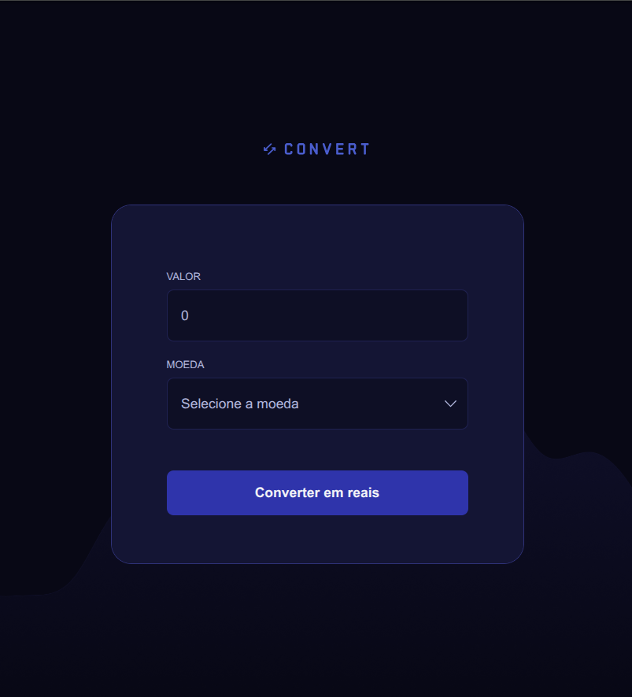

# Conversor de Moedas 💱

Aplicação web simples e responsiva para conversão de moedas estrangeiras para Real Brasileiro (BRL), desenvolvida com HTML, CSS e JavaScript puro, durante o curso Especialista Full Stack da Rocketseat.

---

## 📸 Preview

<p align="center">
  
</p>

---

# 🚀 Funcionalidades

- Conversão de:
  - Dólar Americano (USD)
  - Euro (EUR)
  - Libra Esterlina (GBP)
- Interface moderna e responsiva
- Validação de entrada numérica
- Formatação automática para moeda brasileira
- Exibição dinâmica do resultado
- Manipulação de DOM com JavaScript puro

---

# 🛠️ Tecnologias utilizadas

- HTML5
- CSS3
- JavaScript (Vanilla JS)
- Google Fonts

---

# 📂 Estrutura do projeto

```bash
📦 convert
 ┣ 📂 img
 ┃ ┣ 📜 bg.png
 ┃ ┣ 📜 chevron-down.svg
 ┃ ┗ 📜 logo.svg
 ┣ 📜 index.html
 ┣ 📜 styles.css
 ┣ 📜 scripts.js
 ┗ 📜 README.md
```

---

# 🎨 Layout

O projeto possui:

- Background customizado
- Inputs estilizados
- Select customizado
- Resultado dinâmico
- Scrollbar personalizada
- Design moderno com paleta escura

---

# ⚙️ Visualizar projeto

Acesse: https://Matheus-Souza97.github.io/convert

---

# 🧠 Conceitos praticados

- Manipulação do DOM
- Eventos no JavaScript
- Regex
- Estruturas condicionais (`switch`)
- Funções reutilizáveis
- Tratamento de erros com `try/catch`
- Formatação de moedas com `toLocaleString`
- Responsividade
- Organização de código

---

# 📖 Exemplo de conversão

```txt
US$ 1 = R$ 4,87

100 USD → R$ 487,00
```

---

# 👨‍💻 Autor

Desenvolvido por Matheus Souza🚀

---

# 📄 Licença

Este projeto está sob a licença MIT.
